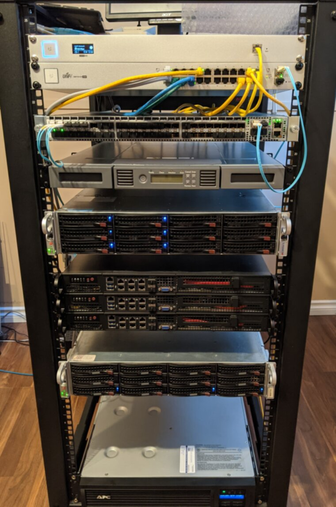

# homelab

These are the NixOS configurations for my home servers. I'm publishing them in the hopes that someone finds them useful, but they're not directly usable. For one they're custom to my machines and what I do with them. For another, some private files are encrypted.

# Hardware

Top to bottom:

 * [Unifi Cloud Key G2](https://ui.com/consoles) network controller, in its rackmount bracket
 * [Unifi Switch 24 PoE (250W)](https://store.ui.com/products/usw-24-poe): 1G networking and PoE for downstream switches elsewhere in the house
 * [Arista 7050S-52](https://www.arista.com/assets/data/pdf/Datasheets/7050S_Datasheet.pdf): 10G networking, also miniature jet engine even with fans forced to lowest possible setting

 * [HPE StoreEver 1/8 G2 tape autoloader](https://www.hpe.com/psnow/doc/c04123291?jumpid=in_lit-psnow-red): [LTO-6 tape](https://en.wikipedia.org/wiki/Linear_Tape-Open#Generations) backup and archival

 * [Supermicro SuperStorage 5028R-E1CR12L](https://www.supermicro.com/en/products/system/2U/5028/SSG-5028R-E1CR12L.cfm): primary NAS, hypervisor
   * [Intel Xeon E5-2680 v4](https://ark.intel.com/content/www/us/en/ark/products/91754/intel-xeon-processor-e52680-v4-35m-cache-2-40-ghz.html): 14 cores/28 threads @ 2.4GHz base, 3.3GHz boost
   * 128GiB RAM (8 x 16GiB DDR4 ECC)
   * 256GB boot SSD
   * 60TB raw storage (6 x [Seagate Exos X10 10TB](https://www.seagate.com/ca/en/enterprise-storage/exos-drives/exos-x-drives/exos-x10/)) in ZFS raidz2 (36TiB usable)
   * [Intel X520 dual-SFP+ 10G NIC](https://www.intel.ca/content/www/ca/en/products/docs/network-io/ethernet/network-adapters/ethernet-x520-server-adapters-brief.html)
   * [LSI 9300-8i SAS3 HBA](https://www.broadcom.com/products/storage/host-bus-adapters/sas-9300-8i), connected to chassis backplane, with addon external mini SAS HD expansion ports

 * 3 x [Supermicro SYS-5018D-FN8T](https://www.supermicro.com/products/system/1u/5018/SYS-5018D-FN8T.cfm): decommissioned Kubernetes cluster, now random lab things
   * 32 GB RAM
   * 256GB boot NVMe SSD
   * 1TB data HDD

 * Whitebox server based on Supermicro CSE826-R1200LPB chassis: backups storage, former primary NAS
   * Supermicro X10SLM+-LN4F motherboard
   * Intel Xeon E3-1220 v3: 4 cores/4 threads @ 3.1GHz base, 3.5GHz boost
   * 32GiB RAM (4 x 8GiB DDR3 ECC)
   * 128GiB boot SSD
   * 48TB raw storage (6 x [WD Red 8TB](https://www.newegg.ca/red-wd80efzx-8tb/p/N82E16822235063)) in ZFS raidz2 (32.5TiB usable)
   * [Intel X520 dual-SFP+ 10G NIC](https://www.intel.ca/content/www/ca/en/products/docs/network-io/ethernet/network-adapters/ethernet-x520-server-adapters-brief.html)
   * LSI 9207-8i SAS2 HBA, connected to chassis backplane

 * [APC Smart-UPS SMT1500RM2U](https://www.apc.com/shop/ca/en/products/APC-Smart-UPS-1500VA-LCD-RM-2U-120V-Not-for-sale-in-CO-VT-or-WA-/P-SMT1500RM2U): backup power for the whole chassis, via distributor PDU in rear of rack.

Not pictured:

 * Dell R610 server: first homelab machine, now decommissioned.
 * Dell R210 server: old home router, replaced with Eero.
 * Mellanox SX6015 Infiniband switch: stupid impulse purchase, not commissioned yet (need more infiniband hardware+skills)
